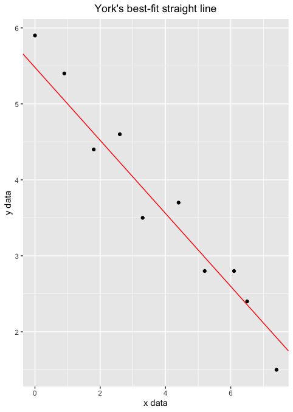
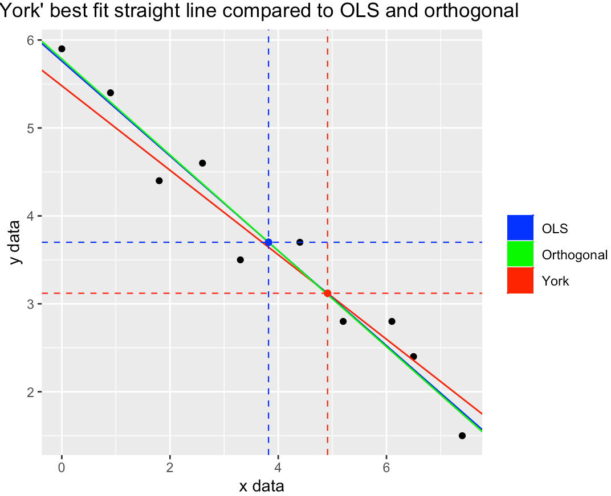
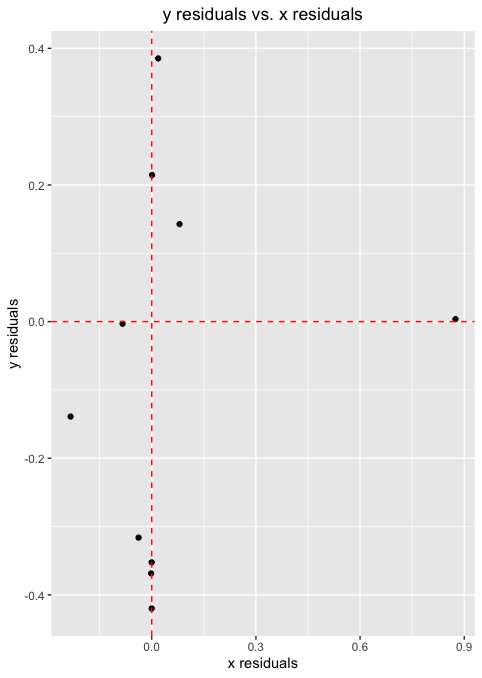
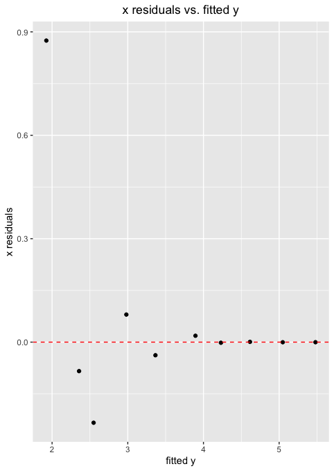
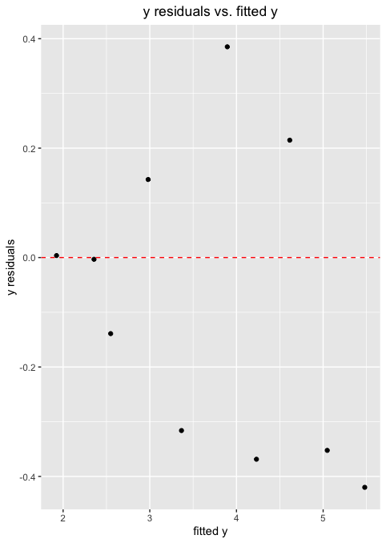
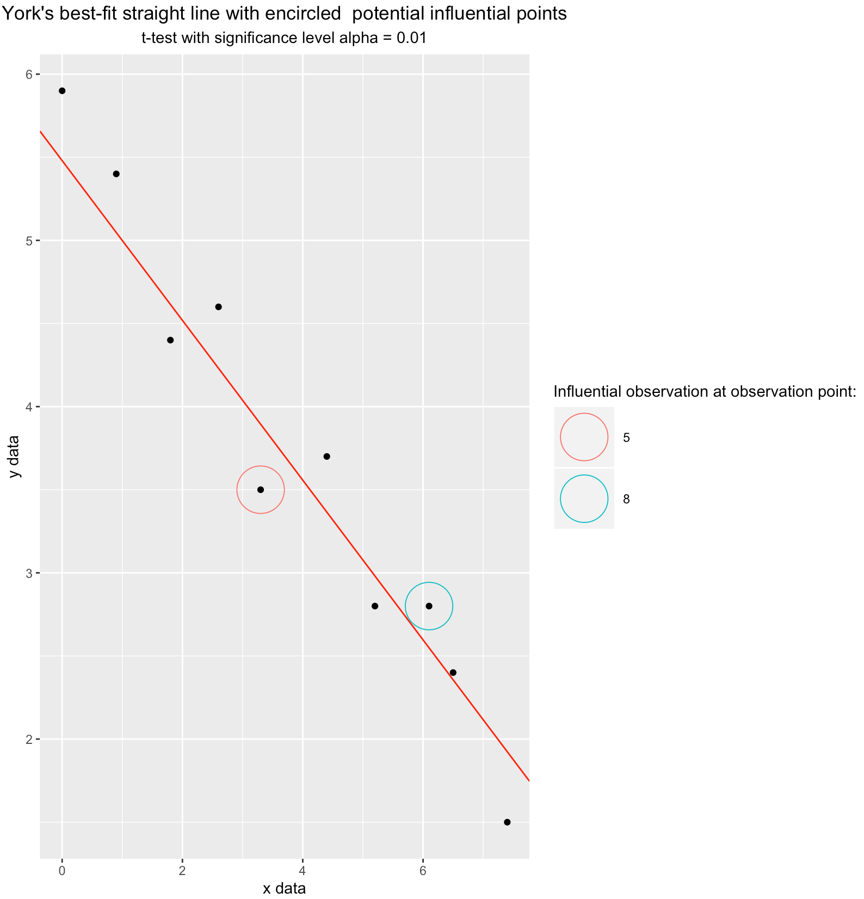
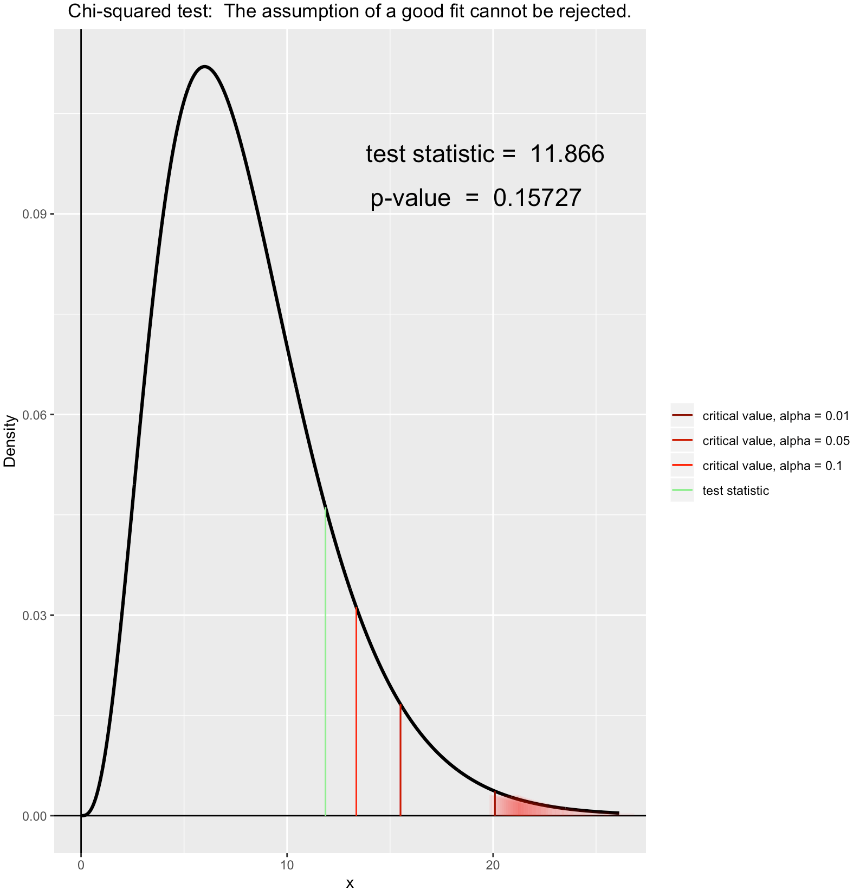
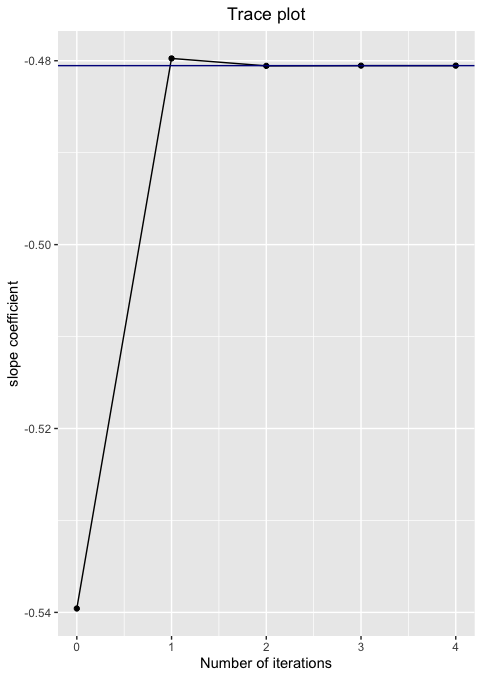

> *Copyright 2019 Jonas Cedro Delgado, Jens Lichter. Licensed under the MIT license.*

`yorkregression` is a R package for running a York's regression using ggplot2, stats and utils.

This software was developed by **Jonas Cedro Delgado** and **Jens Lichter** and is available freely.

## Installation
`yorkregression` is available through GitHub:

To install the latest development version from GitHub:

```{r}
# install.packages("devtools")
devtools::install_github("JENScoding/yorkregression")
```

## Examples
###Example 1 (x, y, weights as input)
```{r}
# data
x <- c(0.0, 0.9, 1.8, 2.6, 3.3, 4.4, 5.2, 6.1, 6.5, 7.4)
y <- c(5.9, 5.4, 4.4, 4.6, 3.5, 3.7, 2.8, 2.8, 2.4, 1.5)
wx <- c(1e+3, 1e+3, 5e+2, 8e+2, 2e+2, 8e+1, 6e+1, 2e+1, 1.8, 1)
wy <- c(1, 1.8, 4, 8, 20, 20, 70, 70, 1e+2, 5e+2)

# fit model
fit <- york(x, y, wx, wy, r_xy_errors = 0)
summary(fit)
$x_Residuals
   Min. 1st Qu.  Median    Mean 3rd Qu.    Max. 
 -0.234  -0.029   0.000   0.062   0.014   0.875 

$y_Residuals
   Min. 1st Qu.  Median    Mean 3rd Qu.    Max. 
 -0.420  -0.343  -0.071  -0.085   0.108   0.385 

$Coefficients
          Estimate Std_Error
intercept  5.47991    0.0794
slope     -0.48053    0.0156

$Regression_Test
[1] "Chisq-statistic: 11.866 on 8 degrees of freedom,  p-value: 0.15727"              
[2] "The assumption of a good fit cannot be rejected  at a significance level of 10%."

plot.york(fit)

```

{width=30% } {
width=50% }
{width=30% } {width=30% }
{width=30% } {width=50% }
{width=45% } {
width=30%}


Prediction
```{r}
newdata <- c(5, 7.5, 8)
predict(fit, newdata)
$prediction
    x predict_y
1 5.0  3.077243
2 7.5  1.875910
3 8.0  1.635643
```


Orthogonal and OLS are special cases of York's regression
```{r}
fit_orthogonal <- york(x, y, weights_x =  1, weights_y =  1, r_xy_errors = 0)
fit_ols <- york(x, y, weights_x =  1e+5, weights_y =  1, r_xy_errors = 0)
fit_orthogonal$coefficients[2, 1]; fit_ols$coefficients[2, 1]
[1] -0.5455612
[1] -0.5395774
```


#### Example 2 (x and y variables are data frames )
```{r}
## generate data with small measurment error and correlated errors
# use old data x and y as mean
x_mult_error <- list()
y_mult_error <- list()
x_mult <- list()
y_mult <- list()
set.seed(42)
for (i in 1:10){
   x_mult_error[[i]] <-  rnorm(10, sd = 0.1)
   y_mult_error[[i]] <-  rnorm(10, sd = 0.05)
   x_mult[[i]] <- x + x_mult_error[[i]]
   y_mult[[i]] <- y + x_mult_error[[i]] * 0.3 + y_mult_error[[i]]
 }

y_mult <- data.frame(y_mult)
colnames(y_mult) <- 1:10
x_mult <- data.frame(x_mult)
colnames(x_mult) <- 1:10


# fit model
fit_mult <- york(x_mult, y_mult, mult_samples = TRUE)

fit_mult$weights
      weights of x weights of y
 [1,]    115.85499     333.6681
 [2,]    138.11949     314.1123
 [3,]    375.57714     293.5435
 [4,]    112.32298     697.5198
 [5,]    108.24826     222.1187
 [6,]    128.59193     386.9139
 [7,]    170.57251     418.8345
 [8,]     81.79396     142.7366
 [9,]    110.71790     208.5024
[10,]    137.50294     767.4863

fit_mult$data$error_correlation
 [1]  0.81671605  0.36207729  0.37025401 -0.21928085  0.79415144  0.41860857
 [7]  0.68310297  0.44561769  0.02630725  0.39292339
```

